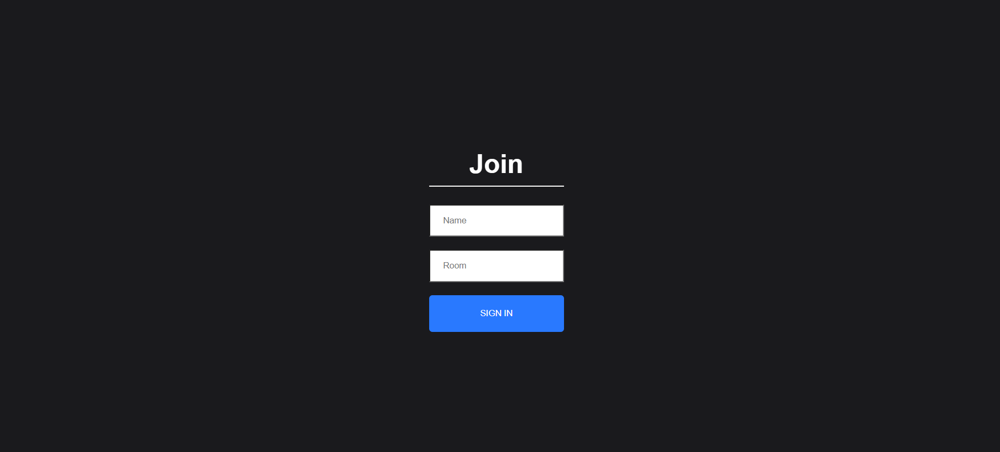

# Real-Time Chat Application using Socket.io, Node.js, and React.js

## Overview

This application enables real-time communication among multiple users in a chat room. It utilizes Socket.io for seamless and instantaneous messaging, Node.js for the backend, and React.js for the frontend, providing an intuitive user interface.

## Features

- **Real-time messaging:** Users can send and receive messages in real-time, creating a dynamic and interactive chat experience.
- **Multiple users:** The application supports multiple users simultaneously, allowing for group conversations.
- **Intuitive UI:** The frontend is built using React.js, offering a user-friendly and responsive interface.
- **Easy deployment:** The application is built using popular technologies, making it easy to deploy on various platforms.

## Screenshots

### Join Page

### User I Interface

### User II Interface

## Live Site

Access the live chat application [here](https://64cbf22f1f25c20a3fc41343--lighthearted-capybara-1ab8f6.netlify.app/).

## Installation and Usage

1. **Clone the repository:** `git clone https://github.com/pandeydhruv2001/Real-Time-Chat-Application.git`
2. **Navigate to the project directory:**
   - Backend: `cd Real-Time-Chat-Application/server`
   - Frontend: `cd Real-Time-Chat-Application/client`
3. **Install dependencies:**
   - Backend: `npm install`
   - Frontend: `npm install`
4. **Run the application:**
   - Backend: `npm start`
   - Frontend: `npm start`
5. **Open your web browser and visit:** `http://localhost:3000` to access the application.

## Suggestions and Feedback

We welcome your suggestions and feedback for improving the Real-Time Chat Application. If you have any ideas, feature requests, or encounter any issues, please feel free to reach out to us via email at [dp0689@srmist.edu.in](mailto:your.email@example.com).

## Contributing

We welcome contributions to enhance the application's features and fix issues. If you'd like to contribute, please follow these steps:

1. Fork the repository
2. Create a new branch: `git checkout -b feature/your-feature-name`
3. Make your changes and commit them: `git commit -am 'Add some feature'`
4. Push to the branch: `git push origin feature/your-feature-name`
5. Create a pull request

## Credits

- Socket.io documentation and tutorials
- Node.js documentation
- React.js documentation and tutorials

## License

This project is licensed under the MIT License.
